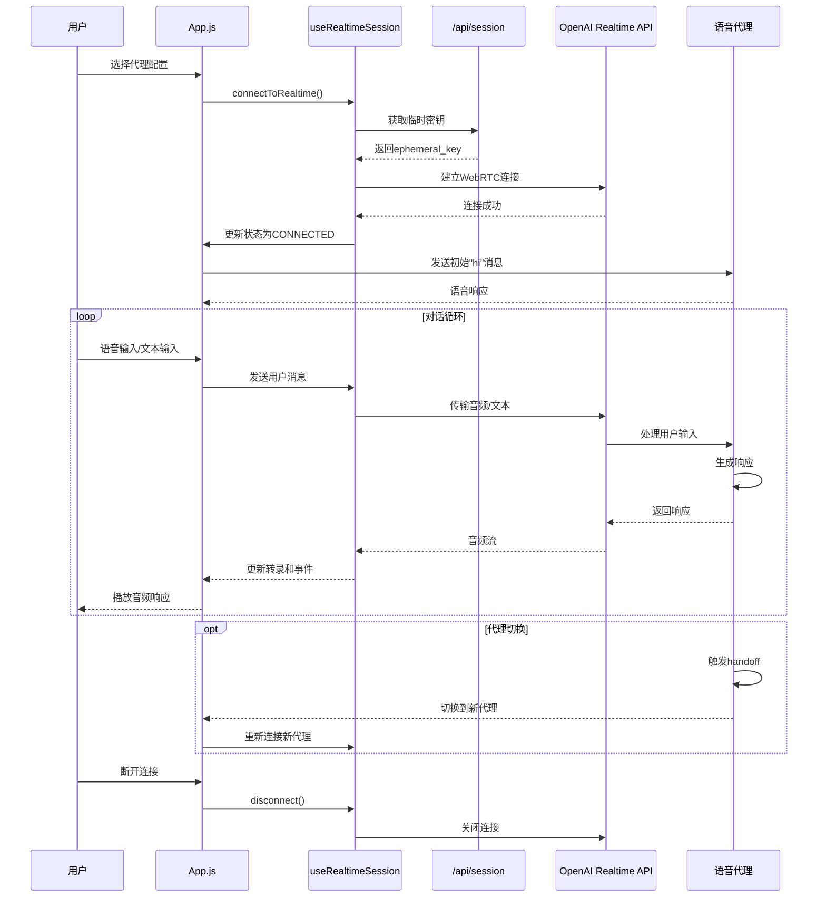
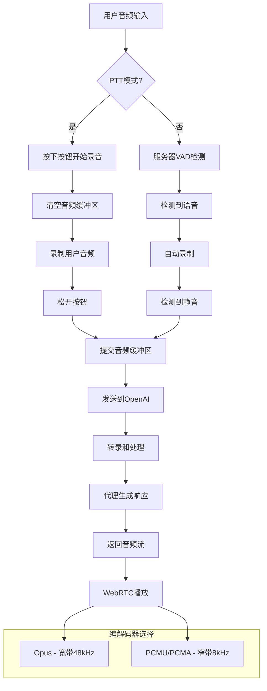

# CLAUDE.md

This file provides guidance to Claude Code (claude.ai/code) when working with code in this repository.

## 项目概述

这是一个基于OpenAI Realtime API的Next.js应用程序，实现了实时语音代理系统。系统支持多代理配置、自动切换、音频编解码器选择和基于WebRTC的音频流传输。

## 开发命令

```bash
# 启动开发服务器（使用Turbopack）
npm run dev

# 构建生产版本
npm run build

# 启动生产服务器
npm start

# 代码检查
npm run lint
```

## 核心架构

### 代理系统
- **代理配置** (`app/agentConfigs/`): 三个主要场景 - `simpleHandoff`、`customerServiceRetail` 和 `chatSupervisor`
- **多代理支持**: 代理可以将对话转交给其他专业代理
- **防护栏**: 针对代理响应的审核和安全控制

### 音频处理
- **WebRTC集成**: 支持编解码器选择的实时音频流（Opus/PCMU/PCMA）
- **一键通话**: 可选的PTT模式，禁用服务器VAD
- **音频录制**: 会话录制和下载功能
- **编解码器测试**: 在宽带(48kHz)和窄带(8kHz)之间切换以模拟PSTN

## 代码架构图

```mermaid
graph TB
    subgraph "前端应用"
        A[App.js - 主应用] --> B[Transcript - 对话显示]
        A --> C[Events - 事件日志]
        A --> D[BottomToolbar - 工具栏]
    end
    
    subgraph "Hooks层"
        E[useRealtimeSession] --> F[useHandleSessionHistory]
        E --> G[useAudioDownload]
        A --> E
    end
    
    subgraph "Context层"
        H[TranscriptContext] --> A
        I[EventContext] --> A
    end
    
    subgraph "代理配置"
        J[simpleHandoff] --> K[agentConfigs/index.js]
        L[customerServiceRetail] --> K
        M[chatSupervisor] --> K
        K --> A
    end
    
    subgraph "后端API"
        N[/api/session] --> O[获取临时密钥]
        P[/api/responses] --> Q[响应处理]
    end
    
    subgraph "OpenAI服务"
        R[Realtime API] --> S[WebRTC传输]
        T[转录服务] --> R
    end
    
    A --> N
    E --> R
    S --> E
```

## 实时会话流程图



## 音频处理流程图



## 关键组件

### 主要文件
- **App.js**: 主应用程序协调器，处理连接、代理管理和UI状态
- **useRealtimeSession**: 管理WebRTC连接和会话事件的核心Hook
- **Transcript/Events**: 用于对话显示和事件记录的UI组件
- **Context Providers**: TranscriptContext和EventContext用于状态管理

### Hook工具
- **useRealtimeSession**: WebRTC连接管理和事件处理
- **useHandleSessionHistory**: 转录和会话历史管理
- **useAudioDownload**: 音频录制功能
- **codecUtils**: 音频编解码器偏好处理

## 环境要求

- 需要OpenAI API密钥用于临时令牌生成
- Realtime API访问权限
- 支持WebRTC的现代浏览器

## 代理配置结构

每个代理场景定义为RealtimeAgent对象数组，包含：
- 具有工具和切换能力的代理定义
- 特定公司的上下文和品牌
- 用于测试场景的示例数据

默认代理集为`chatSupervisor`，具有自动回退处理。

## URL参数

- `?agentConfig=<scenario>`: 选择代理配置 (simpleHandoff, customerServiceRetail, chatSupervisor)
- `?codec=<codec>`: 强制音频编解码器 (opus, pcmu, pcma)

## 开发提示

- 使用Turbopack进行快速开发构建
- 支持热重载和实时预览
- 确保环境变量正确配置OpenAI API访问
- 测试时注意浏览器的WebRTC权限设置