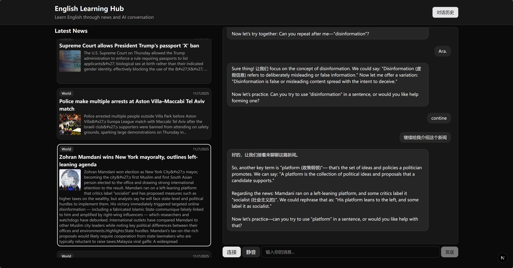
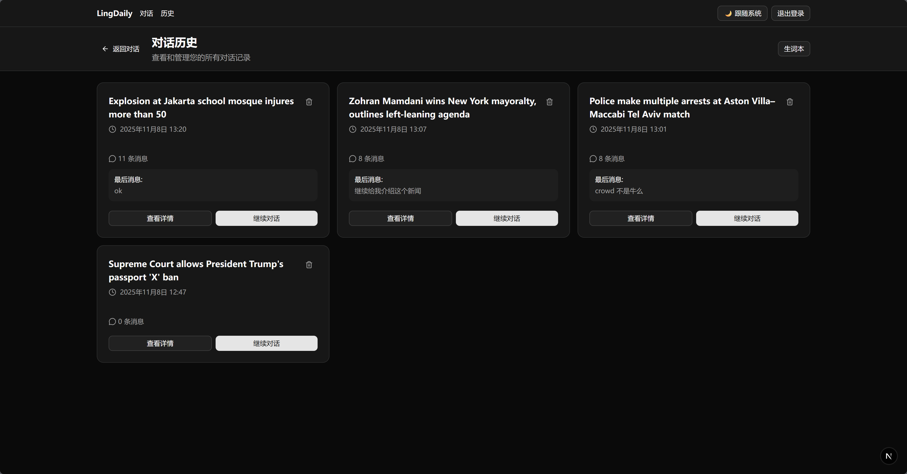
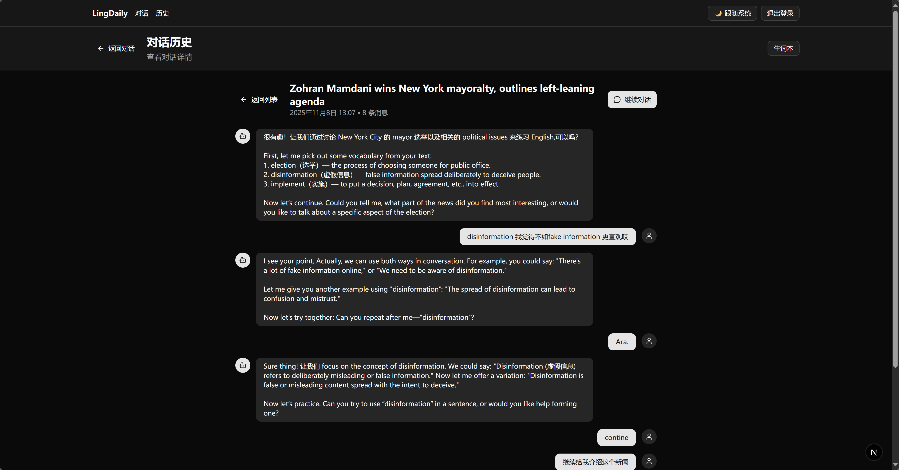
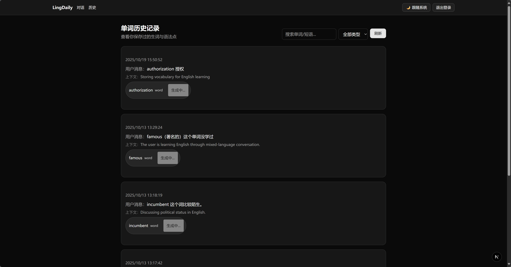

# LingDaily

AI 驱动的英语新闻会话练习应用，基于 Next.js App Router 与 NextAuth 构建。用户可以通过邮箱或（在配置后）Google 账号登录，和 OpenAI Realtime 能力驱动的对话助手持续练习口语并追踪词汇。


## 效果


### 主页


### 聊天



### 历史



### 历史详情



### 生单词



## 快速开始

1. 安装依赖
   ```bash
   npm install
   ```
2. 配置环境变量（详见下方表格），在项目根目录创建 `.env.local`。
3. 启动开发服务器
   ```bash
   npm run dev
   ```
4. 在浏览器访问 `http://localhost:3000`。

构建与生产启动：
```bash
npm run build
npm run start
```

## 环境变量

在 `.env.local` 中按需配置以下变量（所有值均为示例，请替换为自己的配置）：

| 变量名 | 示例 | 说明 |
| --- | --- | --- |
| `AUTH_SECRET` | `openssl rand -base64 32` 生成 | NextAuth 用于签名 JWT 的密钥。务必保密。 |
| `AUTH_URL` | `http://localhost:3000` | NextAuth 基准 URL，本地开发通常为 localhost，部署时填入公网域名。 |
| `OPENAI_API_KEY` | `sk-...` | OpenAI API Key，用于实时会话能力。 |
| `NEXT_PUBLIC_SUPABASE_URL` | `https://your-project.supabase.co` | Supabase 项目 URL，需对外暴露，因此使用 `NEXT_PUBLIC_` 前缀。 |
| `NEXT_PUBLIC_SUPABASE_ANON_KEY` | `eyJhbGciOi...` | Supabase 匿名密钥，供前端访问。 |
| `SUPABASE_SERVICE_ROLE_KEY` | `eyJhbGciOi...` | Supabase Service Role Key，仅在服务器端使用，勿泄露。 |
| `AUTH_GOOGLE_ID` | `1234567890-xxxx.apps.googleusercontent.com` | （可选）Google OAuth Client ID。缺失时将自动关闭 Google 登录。 |
| `AUTH_GOOGLE_SECRET` | `GOCSPX-xxxx` | （可选）Google OAuth Client Secret，需与上方 Client ID 对应。 |

> **提示**：如需开启 Google 登录，在 [Google Cloud Console](https://console.cloud.google.com/) 为 Web 应用创建 OAuth2 凭据，回调 URL 设为 `${AUTH_URL}/api/auth/callback/google`，并将生成的 Client ID/Secret 写入上述变量。

## 功能要点

- 使用 NextAuth v5 集成邮箱密码与可选的 Google 登录。若未配置 `AUTH_GOOGLE_ID/SECRET`，后端不会注册对应 provider，前端登录页也不会显示 Google 选项。
- 与 Supabase 集成以存储用户数据，并在凭证登录时透传 Supabase Access Token（用于受 RLS 保护的 API 调用）。
- 通过 OpenAI Realtime 能力提供实时对话练习。
- 使用 Tailwind CSS 与自定义 UI 组件实现响应式界面。

## 开发提示

- 建议使用 `npm run lint` 保障代码风格。
- 生产环境请将所有密钥安全地注入部署平台，不要提交到版本库。
- 更新 Supabase Service Role Key 后需同步重启应用，以便 Next.js 读取最新环境变量。

## 部署建议

1. 在部署平台（Vercel、Render 等）配置上文提到的全部环境变量。
2. 确保 `AUTH_URL` 与部署域名完全一致（包含协议），否则 OAuth 回调可能失败。
3. 若不启用 Google 登录，可省略 `AUTH_GOOGLE_ID/SECRET`，应用会自动仅保留邮箱登录。
4. 使用 `npm run build` 预构建，确认通过后再进行上线。
```
curl -X POST https://api.openai.com/v1/realtime/client_secrets \
   -H "Authorization: Bearer $token" \
   -H "Content-Type: application/json" \
   -d '{
     "session": {
       "type": "realtime",
       "model": "gpt-realtime-mini"
     }
   }'
```
## sitemap
use this to generate sitemap
`npm run sitemap`